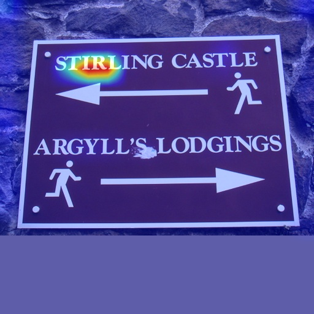
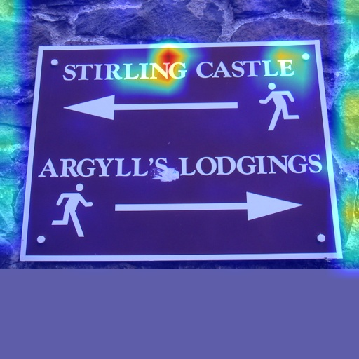

# oCLIP

This repository is the official implementation for the following paper:

[Language Matters: A Weakly Supervised Vision-Language Pre-training Approach for Scene Text Detection and Spotting](https://arxiv.org/abs/2203.03911)

Chuhui Xue, Wenqing Zhang, Yu Hao, Shijian Lu, Philip Torr, Song Bai, ECCV 2022 (Oral)

Part of the code is inherited from [open_clip](https://github.com/mlfoundations/open_clip).

# Models

* English

| Backbone | Pre-train Data | Pre-train Model | Fine-tune Data | Fine-tune Model ([PSENet](https://github.com/whai362/PSENet)) | Precision | Recall | F-score |
|----------|----------------|-----------------|----------------|----------------|-----------|-----------|-----------|
| ResNet-50 | [SynthText](https://www.robots.ox.ac.uk/~vgg/data/scenetext/) | [Link](https://1drv.ms/u/s!Al-Eh1QsezDHhONgVq_Q-h28M5NSTg?e=Elvcsj) | [Total-Text](https://github.com/cs-chan/Total-Text-Dataset) | [Link](https://1drv.ms/u/s!Al-Eh1QsezDHhONkmHtayDoqTHLgkg?e=zu64Iv) | 89.9 | 81.6 | 85.5 |
| ResNet-101 | [SynthText](https://www.robots.ox.ac.uk/~vgg/data/scenetext/) | [Link](https://1drv.ms/u/s!Al-Eh1QsezDHhONibwNePlvoa49oUg?e=2jjbEa) | [Total-Text](https://github.com/cs-chan/Total-Text-Dataset) | [Link](https://1drv.ms/u/s!Al-Eh1QsezDHhONm7Jdoi58GXb67gg?e=X0K39L) | 89.9 | 82.2 | 85.9 |
| ResNet-50 | Web Image | [Link](https://1drv.ms/u/s!Al-Eh1QsezDHhONhJgZBfPf0ymJ3YA?e=6SZR4w) | [Total-Text](https://github.com/cs-chan/Total-Text-Dataset) | [Link](https://1drv.ms/u/s!Al-Eh1QsezDHhONlCkGsx0zLJkSrbw?e=ng4hSt) | 90.1 | 83.5 | 86.7 |

* Chinese

| Backbone | Pre-train Data | Pre-train Model |
|----------|----------------|----------------|
| ResNet-50 | [LSVT-Weak Annotation](https://rrc.cvc.uab.es/?ch=16&com=introduction) | [Link](https://1drv.ms/u/s!Al-Eh1QsezDHhONjIta2HhLeSNPhgw?e=ziQaBe) |

# Training oCLIP

## Conda
```Bash
conda create -n oclip python=3.7
conda activate oclip
pip install -r requirement.txt

git clone https://github.com/bytedance/oclip.git
cd oclip
export PYTHONPATH="$PYTHONPATH:$PWD/src"
```

## Data
Download [SynthText](https://www.robots.ox.ac.uk/~vgg/data/scenetext/) and put it to ./data.

You may use the provided script to generate the annotation for pre-training:
```Bash
python tools/convert_synthtext_csv.py --data_dir data/SynthText/ --save_dir data/SynthText/
```
* Note we use [space] to represent the masked characters. For customized datasets, you may modify codes in src/training/data.py and your data annotation accordingly.

## Train
Sample running code for training:
```Bash
CUDA_VISIBLE_DEVICES=0,1,2,3 python3 -u src/training/main.py \
    --save-frequency 3 \
    --report-to tensorboard \
    --train-data="data/SynthText/train_char.csv"  \
    --char-dict-pth="data/SynthText/char_dict" \
    --csv-img-key filepath \
    --csv-caption-key title \
    --warmup 10000 \
    --batch-size=64 \
    --lr=1e-4\
    --wd=0.1 \
    --epochs=100 \
    --workers=8 \
    --model RN50 \
    --logs='output/RN50_synthtext' 
```
# Visualization
We also provide a script for visualization of attention maps in the pre-trained model.

Download the [pre-trained model](https://entuedu-my.sharepoint.com/:u:/r/personal/xuec0003_e_ntu_edu_sg/Documents/opensource/oCLIP/Pre-trained%20Models/RN50_synthtext.pt?csf=1&web=1&e=uVnGWs) to ./pretrained.

```Bash
python3 tools/visualize_attn.py --model_path pretrained/RN50_synthtext.pt --char_dict_path data/SynthText/char_dict --model_config_file src/training/model_configs/RN50.json --im_fn demo/sample.jpg --text_list "ST LING" "STRLIN " "A GYLL'S" " ODGINGS" --demo_path demo/
```

| Input Image | Image Attenion Map | "ST LING" | "STRLIN " | "A GYLL'S" | " ODGINGS" |
|-------------|--------------------|-----------|-----------|------------|------------|
|||||||


# Fine-tune in MMOCR
We provide a script for converting model parameter names, thus it could be used in the dev-1.x branch of [MMOCR](https://github.com/open-mmlab/mmocr/tree/dev-1.x)
```Bash
# first modify the model_path and save_path in tools/convert2mmocr.py
python tools/convert2mmocr.py
```

# Citation
```Text
@article{xue2022language,
  title={Language Matters: A Weakly Supervised Vision-Language Pre-training Approach for Scene Text Detection and Spotting},
  author={Xue, Chuhui and Zhang, Wenqing and Hao, Yu and Lu, Shijian and Torr, Philip and Bai, Song},
  journal={Proceedings of the European Conference on Computer Vision (ECCV)},
  year={2022}
}
```
